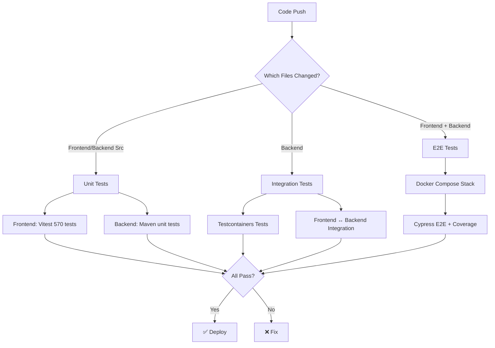

# Testing Strategy

> **Commit**: `a1f0e59` - Complete testing workflow restructure  
> **Date**: October 16, 2025

## 🎯 Overview

Clean separation of testing into 3 distinct layers:

```
┌─────────────────┐
│  Unit Tests     │ ← Fast, local, no external dependencies
├─────────────────┤
│ Integration     │ ← GitHub Actions with services (MySQL, Docker)
├─────────────────┤
│  E2E Tests      │ ← Full stack with Cypress + coverage
└─────────────────┘
```

## 📋 Workflows

### 1. **Unit Tests** (`unit-tests.yml`)
**Purpose**: Fast feedback, run locally with Maven/npm

**Triggers**:
- Push to `main`, `develop`, `FE-tester`
- PRs to `main`, `develop`
- Only when code changes (frontend or backend src)

**Jobs**:
- **Frontend Unit Tests**: Vitest tests, ~570 tests, 90%+ coverage
- **Backend Unit Tests**: Maven tests excluding `*DockerTest` and `*IntegrationTest`

**Runtime**: ~2-3 minutes

**Commands**:
```bash
# Frontend
cd main_frontend/concert1
npm test
npm run test:coverage

# Backend
cd main_backend
mvn test -Dtest='!*DockerTest,!*IntegrationTest'
```

---

### 2. **Integration Tests** (`integration-tests.yml`)
**Purpose**: Test with real services in GitHub Actions

**Triggers**:
- Push/PR to `main`, `develop`
- Only when backend or database changes

**Jobs**:
- **Backend Integration**: Testcontainers + `*DockerTest` + `*IntegrationTest`
- **Frontend ↔ Backend**: Full stack with GitHub Actions MySQL service

**Runtime**: ~8-12 minutes

**Services**:
- MySQL 8.0 (GitHub Actions service)
- Testcontainers for isolated DB tests

---

### 3. **E2E Tests** (`e2e-tests.yml`)
**Purpose**: Full end-to-end testing with Cypress and coverage

**Triggers**:
- Push/PR to `main`
- Only when frontend, backend, or docker-compose changes

**Stack**:
- MySQL (Docker Compose)
- Backend (Spring Boot, built from Dockerfile)
- Frontend (Nuxt dev server)
- Cypress tests with coverage

**Runtime**: ~15-25 minutes (includes Docker build)

**Artifacts**:
- Cypress screenshots (on failure)
- Cypress videos (always)
- E2E coverage reports

**Commands**:
```bash
# Local E2E testing
docker-compose up -d mysql backend
cd main_frontend/concert1
npm run dev &
npm run test:e2e
```

---

## 🚀 Quick Start

### Run All Tests Locally

```bash
# 1. Frontend unit tests
cd main_frontend/concert1
npm test                    # 570 tests, ~7s

# 2. Backend unit tests  
cd main_backend
JAVA_HOME=$(/usr/libexec/java_home -v 21) \
  mvn test -Dtest='!*DockerTest,!*IntegrationTest'

# 3. Backend integration tests (requires Docker)
JAVA_HOME=$(/usr/libexec/java_home -v 21) \
  mvn -DforkCount=1 -DreuseForks=false test \
  -Dtest='*DockerTest,*IntegrationTest'

# 4. E2E tests (full stack)
docker-compose up -d mysql backend
cd main_frontend/concert1
npm run dev &
npm run test:e2e
docker-compose down
```

### Run Specific Test Suites

```bash
# Frontend: Watch mode
npm run test:watch

# Frontend: Coverage
npm run test:coverage

# Backend: Specific test class
mvn test -Dtest=AuthControllerTest

# Backend: Pattern matching
mvn test -Dtest='*Repository*'

# Cypress: Interactive
npm run cy:open

# Cypress: Headless
npm run test:e2e:headless
```

---

## 📊 Coverage Goals

| Layer | Target | Current |
|-------|--------|---------|
| Frontend Unit | 90% | ✅ 90%+ |
| Backend Unit | 85% | ✅ 96% |
| Integration | 80% | 🔄 TBD |
| E2E | 70% | 🔄 TBD |

---

## 🔧 Configuration

### Frontend Test Dependencies (Pinned)
```json
{
  "happy-dom": "15.11.7",
  "vitest": "3.2.0",
  "cypress": "13.17.0",
  "@nuxt/test-utils": "3.19.2"
}
```

### Backend Test Configuration
```xml
<!-- pom.xml -->
<properties>
  <jacoco.version>0.8.12</jacoco.version>
  <testcontainers.version>1.19.8</testcontainers.version>
</properties>
```

### Test Naming Conventions
- **Unit tests**: `*Test.java`, `*.test.ts`
- **Integration tests**: `*IntegrationTest.java`, `*DockerTest.java`
- **E2E tests**: `cypress/e2e/*.cy.ts`

---

## 🐛 Troubleshooting

### Frontend Tests Failing
```bash
# Clear cache and reinstall
rm -rf node_modules package-lock.json
npm install

# Check for locked dependencies
npm ls happy-dom vitest cypress
```

### Backend Tests Failing
```bash
# Use correct JDK
export JAVA_HOME=$(/usr/libexec/java_home -v 21)

# Clean rebuild
mvn clean test

# Check Testcontainers (Docker must be running)
docker ps
```

### E2E Tests Failing
```bash
# Check services
docker-compose ps
docker-compose logs backend

# Verify backend health
curl http://localhost:8080/actuator/health

# Check frontend
curl http://localhost:3000/
```

---

## 📁 File Structure

```
.github/
├── workflows/
│   ├── unit-tests.yml           # ⚡ Fast unit tests
│   ├── integration-tests.yml    # 🔗 Integration tests
│   ├── e2e-tests.yml            # 🌐 E2E with Cypress
│   └── cancel-redundant.yml     # 🚫 Auto-cancel old runs
└── workflows-backup/            # 📦 Old workflows (archived)
    ├── backend-ci.yml
    ├── ci-tests.yml
    ├── frontend-e2e.yml
    └── frontend-tests.yml

main_frontend/concert1/
├── app/                         # Nuxt 4 app
├── cypress/                     # E2E tests
│   └── e2e/*.cy.ts
├── __tests__/                   # Unit tests
│   ├── components/*.test.ts
│   └── pages/*.test.ts
└── vitest.config.ts

main_backend/
├── src/
│   ├── main/java/
│   └── test/java/
│       ├── **/*Test.java         # Unit tests
│       ├── **/*IntegrationTest.java
│       └── **/*DockerTest.java
└── pom.xml
```

---

## 🎯 Test Execution Flow



---

## 📚 Resources

- [Vitest Documentation](https://vitest.dev/)
- [Cypress Documentation](https://docs.cypress.io/)
- [Testcontainers Documentation](https://testcontainers.com/)
- [JaCoCo Maven Plugin](https://www.jacoco.org/jacoco/trunk/doc/maven.html)
- [GitHub Actions Documentation](https://docs.github.com/en/actions)

---

## ✅ Migration Checklist

- [x] Created `unit-tests.yml` for fast feedback
- [x] Created `integration-tests.yml` for service testing
- [x] Created `e2e-tests.yml` for Cypress E2E
- [x] Moved old workflows to backup folder
- [x] Updated path filters for each workflow type
- [x] Added proper timeouts (unit: default, integration: 20min, e2e: 30min)
- [x] Configured coverage uploads to Codecov
- [x] Documented testing strategy
- [ ] Verify all workflows pass on GitHub Actions
- [ ] Update team documentation
- [ ] Train team on new workflow structure

---

**Last Updated**: October 16, 2025  
**Maintained By**: Development Team
